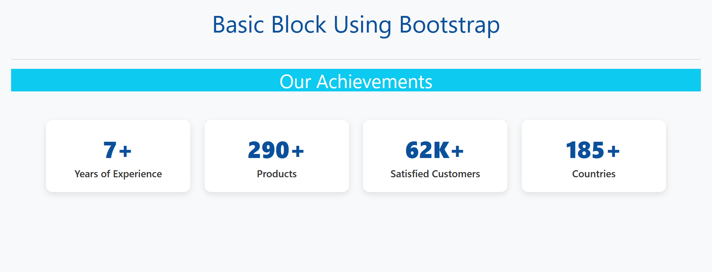

# 📊 Bootstrap Stats Block Example

This project demonstrates a simple, responsive **Stats/Achievement Block** built using [Bootstrap 5]. It displays key performance indicators (KPIs) like years of experience, product count, customer count, and countries served.


## 🚀 Features

- ✅ Responsive layout using Bootstrap Grid
- ✅ Clean card-style design
- ✅ Mobile-friendly (supports all screen sizes)
- ✅ Easy to customize stats and text
- ✅ Ready to integrate into any project homepage or about section

## 📷 Preview

 

## 🔧 Technologies Used

- HTML5
- CSS3
- [Bootstrap 5.3.3 CDN](https://cdn.jsdelivr.net/npm/bootstrap@5.3.3/dist/css/bootstrap.min.css)

## 💡 Use Cases

- Company stats section on a homepage
- Portfolio achievement counter
- SaaS dashboard metrics
- About Us KPIs

```


